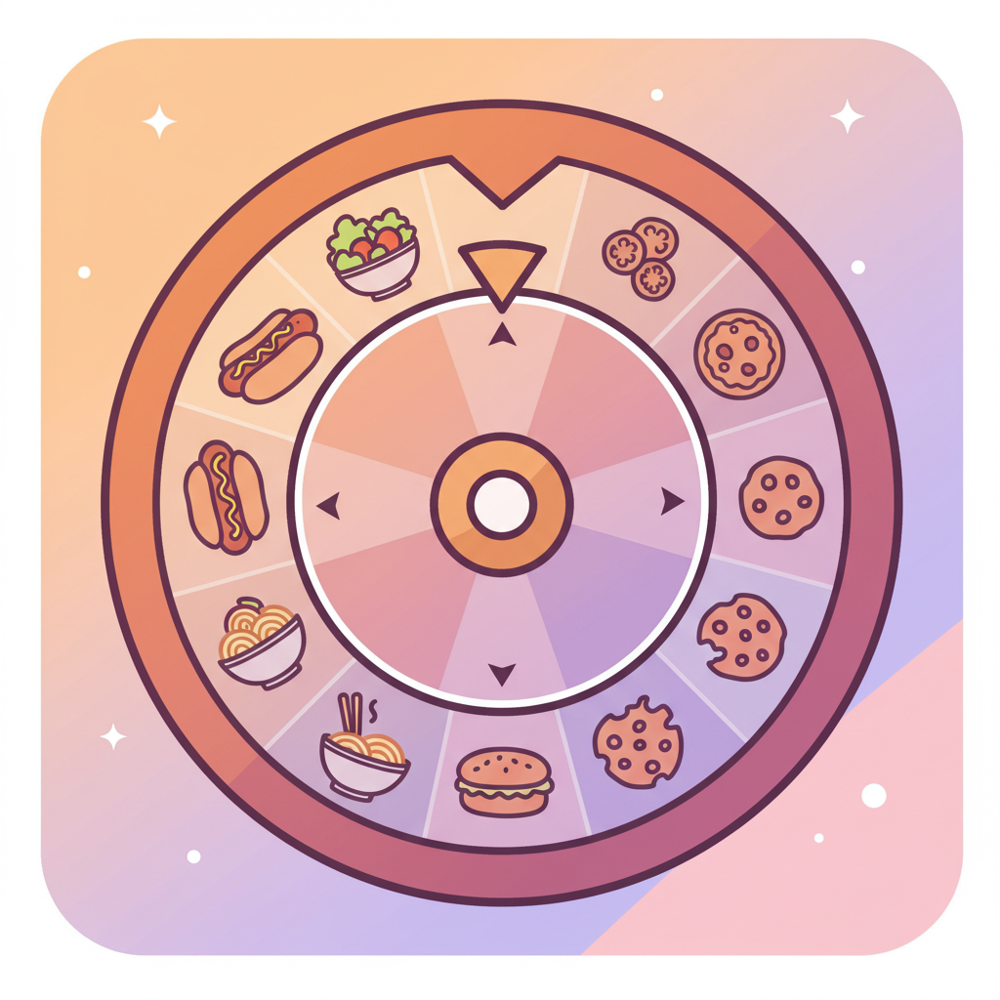

[English](README_EN.md) | [中文](README.md)

# Food Roulette Wheel

A Flutter application that helps you randomly decide what to eat by spinning a wheel, solving the daily dilemma of "What should I eat today?"



## Features

- **Food Wheel**: Beautiful rotatable wheel interface with each food option distinguished by different colors
- **Random Selection**: Trigger rotation animation by clicking the wheel or button to randomly select a food
- **Result Display**: Clearly shows the selected food result after the wheel stops
- **Preset Foods**: Includes various common food options (Hot Pot, Sushi, Pizza, etc.)
- **Smooth Animation**: Implements smooth rotation effects using Flutter animation system

## Technical Implementation

- Developed with Flutter framework, supporting multiple platforms including Android, iOS, and Web
- Adopts Material Design 3 style
- Custom-drawn component for wheel effect
- Uses animation controller for smooth rotation animation
- Random number generator ensures selection randomness

## Installation

### Prerequisites

- Install Flutter SDK (^3.7.0)
- Set up Flutter development environment

### Get the Code

```bash
# Clone the project
git clone https://github.com/zym9863/food_roulette_wheel.git

# Enter project directory
cd food_roulette_wheel

# Install dependencies
flutter pub get
```

### Run the App

```bash
# Run the application
flutter run
```

## How to Use

1. Launch the app and enter the main interface
2. Click the center of the wheel or the "Spin Wheel" button below
3. Wait for the wheel to spin and stop
4. Check the selected food in the result area

## Dependencies

- flutter_animate: ^4.5.0
- simple_animations: ^5.0.2
- cupertino_icons: ^1.0.8

## Developers

To contribute code or report issues, please submit an Issue or Pull Request.

## License

This project is licensed under the MIT License. See the LICENSE file for details.